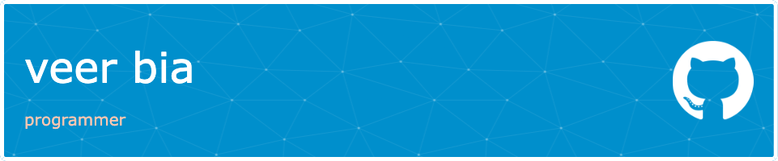

Hi there 👋 

I'm Veer, a 3rd-year Computer Science and Math student at UBC, lifelong learner, and current SWE intern. My mission is to craft beautiful and efficient web applications that make an impact. 

Want to learn more about me? [Check out my portfolio.](https://veerbia.github.io)

 

## 🔭 Current Project

SkillsMarketCap

 

## &#x1f4c8; GitHub Stats
 

 

## 💼 Skills

More Skills

 

 

- 🌱 I’m currently learning GraphQL
- 👨‍💻 Learn more about me [here](https://veerbia.github.io) 
- 👯 I’m interested in collaborating on social impact projects 
- 💬 Ask me about TypeScript, React, and Stochastic Optimization Algorithms
- 📫 How to reach me: [veer-p@outlook.com](mailto:veer-p@outlook.com)

 

## ⚡ Fun facts
- I play a lot of basketball 🏀
- I love learning foreign languages in my free time 🇫🇷 🇨🇳 
- I've never had coffee/tea

